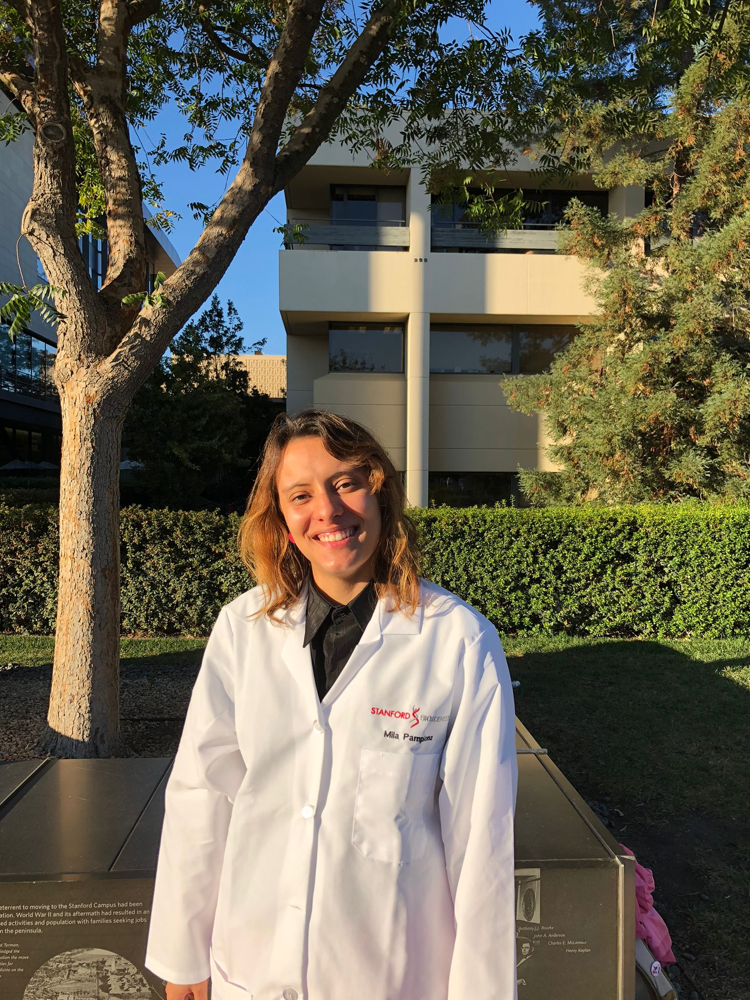
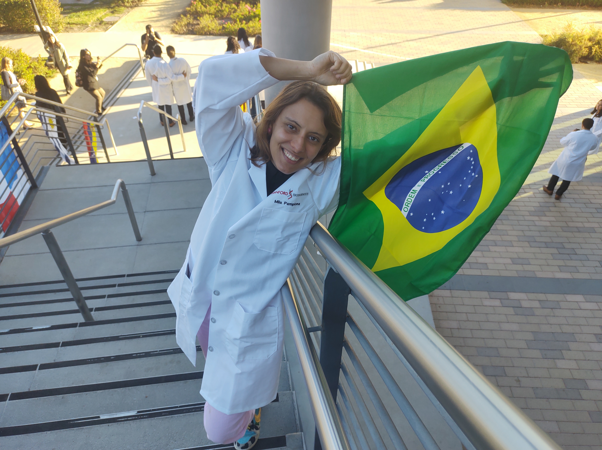
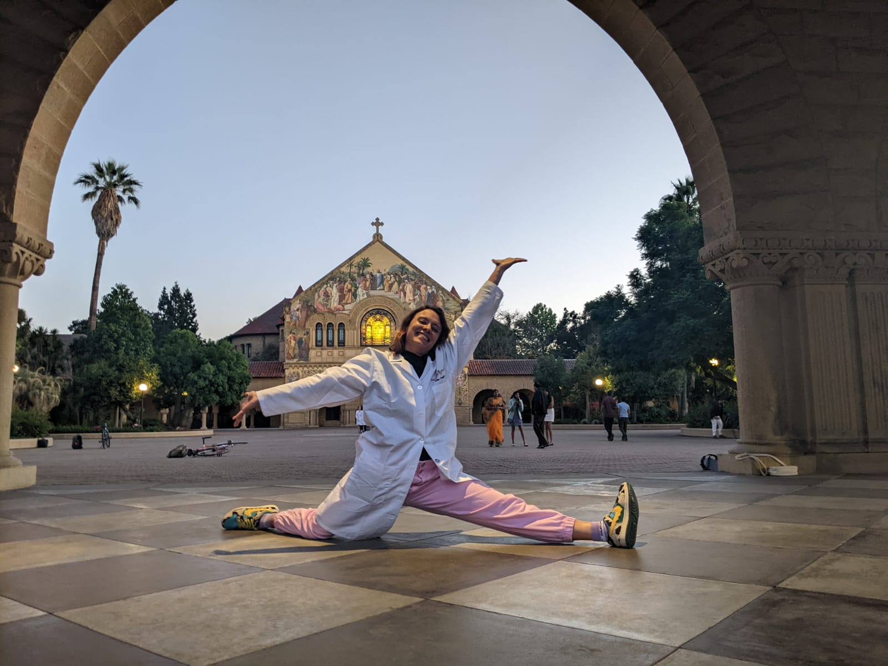
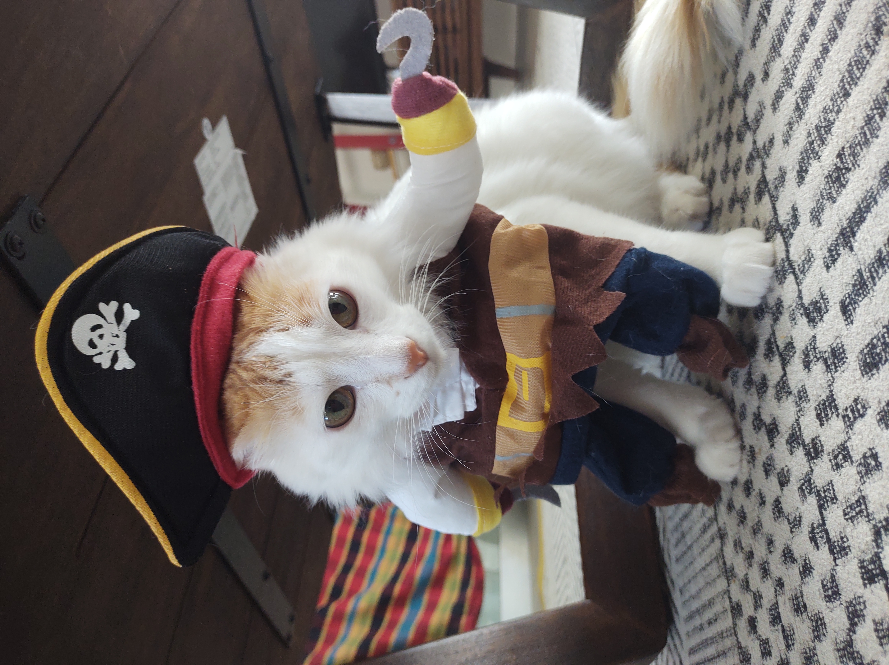

```{r, echo=F, warning=F, message=F}
if (!require("pacman")) install.packages("pacman")
pacman::p_load(knitr)
```


###

```{r, echo=FALSE, fig.cap="Hello! I am Mila.", out.width = '30%', fig.align='center'}

```
   
<h6 style="text-align: center;" markdown="1">

Email: milapamplona@stanford.edu

</h6>     

I'm a brazilian biologist interested in biological rhythms and animal behavior, especially in social insects and their collective behavior. Currently, I'm a PhD student at Stanford University and I have the priviledge (and the luck) to be coadvised by two amazing women researchers: Deborah Gordon and Lauren O'Connell. I'm passionate about science communication and advocacy for diversity, equality and inclusion in science! I believe science and education are important tools to fight social inequality. I also have a podcast and blog in portuguese. You can find out more about my podcast Charlando [here](https://www.charlandopodcast.com/).

```{r, echo=FALSE, out.width = '30%', fig.align='center'}

```

----------------------------------

## More about me

##
```{r, echo=FALSE, out.width = '30%', fig.align='center'}

```

</h6>     

Besides being a passionate young scientist, I spend my free time playing the drums, dancing, trying to learn how to play the ukulele, and mostly: playing with my lovely cats and emotional support animals: Alfredo and Haroldo.

```{r, echo=FALSE, fig.cap="Hi, I'm Alfredinho!", out.width = '30%', fig.align='center'}
knitr::include_graphics("Alfredinho.jpg")
```

```{r, echo=FALSE, fig.cap="Hi, I'm Haroldinho!", out.width = '30%', fig.align='center'}

```


